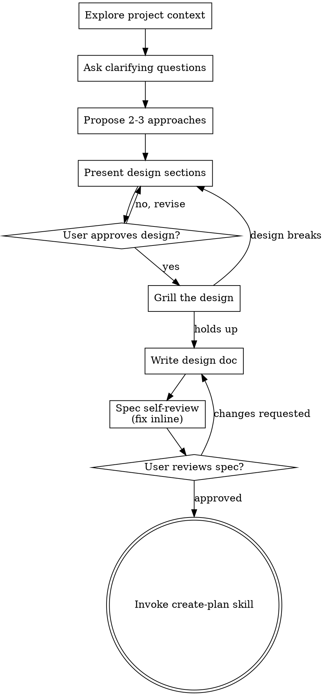

# Specify (Brainstorm → Grill → Design Doc)

Help turn ideas into fully formed designs through natural collaborative dialogue, then harden the
chosen design against what the project already decided.

Start by understanding the current project context, then ask questions one at a time to refine the
idea. Once you understand what you're building, present the design and get user approval. Then, and
only then, turn adversarial: the grill is where a design that sounded right stops being plausible
and starts being precise.

<HARD-GATE>
Do NOT invoke any implementation skill, write any code, scaffold any project, or take any implementation action until you have presented a design and the user has approved it. This applies to EVERY project regardless of perceived simplicity.
</HARD-GATE>

## Anti-Pattern: "This Is Too Simple To Need A Design"

Every project goes through this process. A todo list, a single-function utility, a config change — all of them. "Simple" projects are where unexamined assumptions cause the most wasted work. The design can be short (a few sentences for truly simple projects), but you MUST present it and get approval.

## Checklist

You MUST create a task for each of these items and complete them in order:

1. **Explore project context** — check files, docs, recent commits; detect the context structure
2. **Offer the visual companion just-in-time** — NOT upfront. The first time a question would genuinely be clearer shown than described, offer it then (its own message); on approval its browser tab opens for you. If no visual question ever arises, never offer it. See the Visual Companion section below.
3. **Ask clarifying questions** — one at a time, understand purpose/constraints/success criteria
4. **Propose 2-3 approaches** — with trade-offs and your recommendation
5. **Present design** — in sections scaled to their complexity, get user approval after each section
6. **Grill the approved design** — adversarial pass against the glossary, the ADRs, and the code
7. **Write design doc** — save to `docs/specs/YYYY-MM-DD-<topic>-design.md` and commit
8. **Spec self-review** — quick inline check for placeholders, contradictions, ambiguity, scope
9. **User reviews written spec** — ask user to review the spec file before proceeding
10. **Transition to planning** — invoke create-plan (or the issue-tracker route)

## Process Flow

**The terminal state is invoking create-plan.** Do NOT invoke any implementation or design-build skill. The ONLY skills you invoke after specify are the planning skills named in the hand-off.

## The Process

**Understanding the idea:**

- Check out the current project state first (files, docs, recent commits)
- Before asking detailed questions, assess scope: if the request describes multiple independent subsystems (e.g., "build a platform with chat, file storage, billing, and analytics"), flag this immediately. Don't spend questions refining details of a project that needs to be decomposed first.
- If the project is too large for a single spec, help the user decompose into sub-projects: what are the independent pieces, how do they relate, what order should they be built? Then work the first sub-project through the normal design flow. Each sub-project gets its own spec → plan → implementation cycle.
- For appropriately-scoped projects, ask questions one at a time to refine the idea
- Prefer multiple choice questions when possible, but open-ended is fine too
- Only one question per message - if a topic needs more exploration, break it into multiple questions
- Focus on understanding: purpose, constraints, success criteria
- If a question can be answered by reading the codebase, read it instead of asking

**Exploring approaches:**

- Propose 2-3 different approaches with trade-offs
- Present options conversationally with your recommendation and reasoning
- Lead with your recommended option and explain why
- YAGNI ruthlessly - remove unnecessary features from every approach and design

**Presenting the design:**

- Once you believe you understand what you're building, present the design
- Scale each section to its complexity: a few sentences if straightforward, up to 200-300 words if nuanced
- Ask after each section whether it looks right so far
- Cover: architecture, components, data flow, error handling, testing
- Be ready to go back and clarify if something doesn't make sense

**Design for isolation and clarity:**

- Break the system into smaller units that each have one clear purpose, communicate through well-defined interfaces, and can be understood and tested independently
- For each unit, you should be able to answer: what does it do, how do you use it, and what does it depend on?
- Can someone understand what a unit does without reading its internals? Can you change the internals without breaking consumers? If not, the boundaries need work.
- Smaller, well-bounded units are also easier for you to work with - you reason better about code you can hold in context at once, and your edits are more reliable when files are focused. When a file grows large, that's often a signal that it's doing too much.

**Working in existing codebases:**

- Explore the current structure before proposing changes. Follow existing patterns.
- Where existing code has problems that affect the work (e.g., a file that's grown too large, unclear boundaries, tangled responsibilities), include targeted improvements as part of the design - the way a good developer improves code they're working in.
- Don't propose unrelated refactoring. Stay focused on what serves the current goal.

## The Grill

Goal: stress-test the **approved** design against the existing domain model and the code. Opposite stance from everything above — be adversarial and precise. Interview relentlessly, one question at a time, walking each branch of the decision tree and resolving dependencies between decisions. For each question, give your recommended answer. If a question can be answered by exploring the codebase, explore instead of asking.

Do not blend this with the brainstorm. Finish the design and get approval first; a grill that starts while you're still exploring just makes the exploration hostile.

**Detect the context structure** during step 1, and target the right one here:

- If `CONTEXT-MAP.md` exists at the root → multiple contexts. It lists the contexts, where each lives, and how they relate. Each context has its OWN `CONTEXT.md` and `docs/adr/`; only system-wide decisions go in the root `docs/adr/`. Infer which context the current topic belongs to and write to THAT one. If it's unclear, ask.
- Else if a root `CONTEXT.md` exists → single context, with one `docs/adr/` at the root.
- Else → single context for now; create a root `CONTEXT.md` lazily when the first term is resolved. Only introduce a `CONTEXT-MAP.md` if the work genuinely spans multiple bounded contexts (and confirm with the user first).

Create files lazily — only when you have something real to write.

During the grill, do all of the following:

- **Challenge against the glossary.** If a term conflicts with the relevant `CONTEXT.md`, call it out immediately: "Your glossary defines X as A, but you seem to mean B — which is it?"
- **Sharpen fuzzy language.** Propose a precise canonical term for vague/overloaded words. Update the relevant `CONTEXT.md` inline the moment a term is resolved — don't batch.
- **Probe with concrete scenarios.** Invent edge-case scenarios that force precision about boundaries between concepts.
- **Cross-reference with code.** If the user states how something works, check whether the code agrees. Surface contradictions.

`CONTEXT.md` is a glossary and nothing else — keep it free of implementation details, specs, or scratch notes. Format: term in bold, one or two sentences defining what it IS, and an `_Avoid_:` line listing rejected synonyms. Only include terms specific to this project's domain, not general programming concepts.

**Offer ADRs sparingly.** Only create an ADR when ALL THREE are true: (1) hard to reverse, (2) surprising without context, (3) the result of a real trade-off with genuine alternatives. Write it to the relevant context's `docs/adr/NNNN-slug.md` (root `docs/adr/` for system-wide decisions). An ADR can be a single paragraph: what's the context, what was decided, and why. Skip it otherwise.

If the grill breaks the design — a scenario it can't answer, a contradiction with the code, a term that turns out to mean something else — go back and revise it with the user before writing anything.

## After the Design

**Documentation:**

- Write the validated design (spec) to `docs/specs/YYYY-MM-DD-<topic>-design.md`
  - (User preferences for spec location override this default)
- The date is the creation date and does not change when the document is revised — git carries the revision history
- Commit the design document to git

**Spec Self-Review:**
After writing the spec document, look at it with fresh eyes:

1. **Placeholder scan:** Any "TBD", "TODO", incomplete sections, or vague requirements? Fix them.
2. **Internal consistency:** Do any sections contradict each other? Does the architecture match the feature descriptions?
3. **Scope check:** Is this focused enough for a single implementation plan, or does it need decomposition?
4. **Ambiguity check:** Could any requirement be interpreted two different ways? If so, pick one and make it explicit.
5. **Glossary agreement:** Does every domain term match the relevant `CONTEXT.md`? A spec that quietly reintroduces a rejected synonym undoes the grill.

Fix any issues inline. No need to re-review — just fix and move on.

**User Review Gate:**
After the spec review loop passes, ask the user to review the written spec before proceeding:

> "Spec written and committed to `<path>`. Please review it and let me know if you want to make any changes before we start writing out the implementation plan."

Wait for the user's response. If they request changes, make them and re-run the spec review loop. Only proceed once the user approves.

**Planning:**

Only after approval, offer the two routes and let the user pick:

- **Lean loop** → invoke `create-plan`, which writes `docs/plans/YYYY-MM-DD-<feature-name>.md`.
- **Issue tracker** → invoke `to-prd` (publishes a PRD as a GitHub issue), then `to-issues` (breaks it into vertical-slice tickets), then `create-plan`.

Do NOT invoke any other skill. Planning is the next step.

## Visual Companion

A browser-based companion for showing mockups, diagrams, and visual options during the design phase. Available as a tool — not a mode. Accepting the companion means it's available for questions that benefit from visual treatment; it does NOT mean every question goes through the browser.

**Offering the companion (just-in-time):** Do NOT offer it upfront. Wait until a question would genuinely be clearer shown than told — a real mockup / layout / diagram question, not merely a UI *topic*. The first time that happens, offer it then, as its own message:
> "This next part might be easier if I show you — I can put together mockups, diagrams, and comparisons in a browser tab as we go. It's still new and can be token-intensive. Want me to? I'll open it for you."

**This offer MUST be its own message.** Only the offer — no clarifying question, summary, or other content. Wait for the user's response. If they accept, start the server with `--open` so their browser opens to the first screen automatically. If they decline, continue text-only and don't offer again unless they raise it.

**Per-question decision:** Even after the user accepts, decide FOR EACH QUESTION whether to use the browser or the terminal. The test: **would the user understand this better by seeing it than reading it?**

- **Use the browser** for content that IS visual — mockups, wireframes, layout comparisons, architecture diagrams, side-by-side visual designs
- **Use the terminal** for content that is text — requirements questions, conceptual choices, tradeoff lists, A/B/C/D text options, scope decisions

A question about a UI topic is not automatically a visual question. "What does personality mean in this context?" is a conceptual question — use the terminal. "Which wizard layout works better?" is a visual question — use the browser.

The grill is terminal work. Its questions are conceptual by nature, and a mockup can't answer whether two terms mean the same thing.

If they agree to the companion, read the detailed guide before proceeding:
[visual-companion.md](visual-companion.md)
